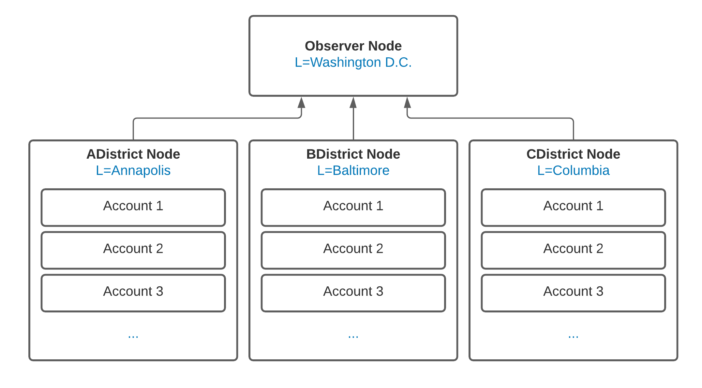

<p align="center">
  
</p>

# Election Voting CorDapp - Java 

This sample describes the way an election could be run using Corda to handle the Electoral Voting Machine (EVM) system.

The sample uses the Accounts SDK and shows the usage of Anonymous accounts and account-to-node interaction.

<p align="center">
  
</p>

# Node Architecture
This sample uses four example nodes:
- An observer node.
- A node for each district in the election, three for demonstration purposes.

## Node Interaction
Each District node will have three accounts created on it and shared with the Observer, these accounts are anonymous to the Observer.
The District nodes aren't aware of the accounts on other District nodes.


# Setting up
Go into the project directory and build the project
```
./gradlew clean deployNodes
```
Run the project
```
./build/nodes/runnodes
```
Now, you should have four Corda terminals opened automatically.


# Shell Instructions (Part 1) - Creating & Sharing Accounts
Go to the ADistrict's node terminal and paste in the following code: (You can select all 6 lines and copy to the terminal all at once)
```
flow start CreateNewAccount acctName: alice-alice
flow start CreateNewAccount acctName: alice-bob
flow start CreateNewAccount acctName: alice-charlie

flow start ShareAccountTo acctName: alice-alice, shareTo: Observer
flow start ShareAccountTo acctName: alice-bob, shareTo: Observer
flow start ShareAccountTo acctName: alice-charlie, shareTo: Observer
```
In BDistrict's node terminal we do something similar:
```
flow start CreateNewAccount acctName: bob-alice
flow start CreateNewAccount acctName: bob-bob
flow start CreateNewAccount acctName: bob-charlie

flow start ShareAccountTo acctName: bob-alice, shareTo: Observer
flow start ShareAccountTo acctName: bob-bob, shareTo: Observer
flow start ShareAccountTo acctName: bob-charlie, shareTo: Observer
```
And in CDistrict's node terminal, similar again:
```
flow start CreateNewAccount acctName: charlie-alice
flow start CreateNewAccount acctName: charlie-bob
flow start CreateNewAccount acctName: charlie-charlie

flow start ShareAccountTo acctName: charlie-alice, shareTo: Observer
flow start ShareAccountTo acctName: charlie-bob, shareTo: Observer
flow start ShareAccountTo acctName: charlie-charlie, shareTo: Observer
```
These flows will generate three accounts on each of the three District nodes and share each of these accounts with the Observer.
This works to provision the nodes and ready them for an election. This would happen during the registration to vote of all the voters.

Under the hood, when these flows run, a `HashAccount` subflow hashes the personally identifiable account names before they are shared with the observer.
This, paired with the use of AnonymousParty means that the Observer node cannot see any personally identifiable information.


You can look at all accounts as they have been created by running the following command on any of the District nodes or the Observer node:
```
run vaultQuery contractStateType: com.r3.corda.lib.accounts.contracts.states.AccountInfo
```

# Shell Instructions (Part 2) - Voting
As each voter walks up to the EVM at their district, they will then be able to vote using their account.
At ADistrict's node, run the votes for the three voters:
```
flow start SendVote whoAmI: alice-alice, observer: Observer, opportunity: 1970, choice: 0
flow start SendVote whoAmI: alice-bob, observer: Observer, opportunity: 1970, choice: 1
flow start SendVote whoAmI: alice-charlie, observer: Observer, opportunity: 1970, choice: 2
```
At BDistrict's node, perform the similar commands:
```
flow start SendVote whoAmI: bob-alice, observer: Observer, opportunity: 1970, choice: 0
flow start SendVote whoAmI: bob-bob, observer: Observer, opportunity: 1970, choice: 1
flow start SendVote whoAmI: bob-charlie, observer: Observer, opportunity: 1970, choice: 1
```
And again at CDistrict's node terminal:
```
flow start SendVote whoAmI: charlie-alice, observer: Observer, opportunity: 1970, choice: 2
flow start SendVote whoAmI: charlie-bob, observer: Observer, opportunity: 1970, choice: 1
flow start SendVote whoAmI: charlie-charlie, observer: Observer, opportunity: 1970, choice: 0 
```

The voters have now cast their votes! ✅ 

To inspect the vault, we can run a vaultQuery on all the VoteStates that are being stored on each node, running either of the following commands
on a District node will show only the votes that the District facilitated, however, running the commands on the Observer node will show all votes from all accounts.
```
run vaultQuery contractStateType: net.corda.samples.election.states.VoteState
```
And:
```
run internalVerifiedTransactionsSnapshot
```
The `opportunity` field refers to the name of the current election opportunity. This is so that one network can handle multiple elections across different years.

The `CountVotes` flow is now capable of making a count of all votes in order to determine a winner. Naturally, the Observer node is the one to make the counts.
We run the command:
```
flow start CountVotes opportunity: 1970
```
to count the votes from the 1970 election.
If you have run the votes as above, you should see a List output:
```
[3, 4, 2, 0, 0, 0, 0, 0, 0, 0]
```
From this, we see that Candidate 2 has the most votes and has won the election! 🏁