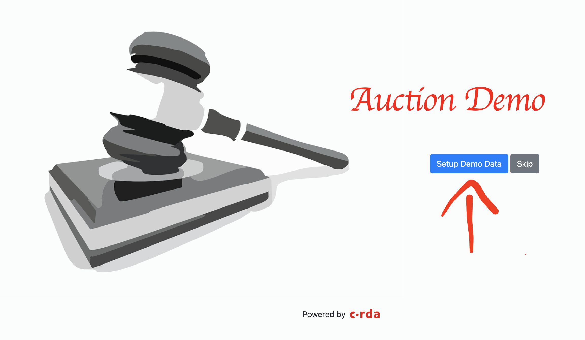

## Advanced Cordapp Samples 

This folder features Advanced sample projects, each of them demonstrates a complex cordapp that uses multiple features of Corda.

### [Auction Cordapp](./auction-cordapp):
An blockchain application that leverages different features of Corda like [SchedulableState](https://docs.corda.net/docs/corda-os/event-scheduling.html#how-to-implement-scheduled-events), [StatePointer](https://docs.corda.net/docs/corda-os/api-states.html#state-pointers)
and [OwnableState](https://docs.corda.net/docs/corda-os/api-states.html#ownablestate). It also demonstrates how to perform a DvP (Delivery vs Payment) transaction on Corda.  

  

### [Due Diligence Cordapp](./duediligence-cordapp):
An capital market themed app that depicts an ideal shareable due diligence process between banks. It uses advance feature attachment functionality to whitelist the trusted auditors.

### [Negotiation Cordapp](./negotiation-cordapp):
An application that depicts the businsess negotiation and communication process over a distributed ledger system.
It consists of the proposing, negotiating, and settling a corda transaction.  

### [Obligation Cordapp](./obligation-cordapp):
A simple i-owe-you application illustrates all of the steps of creating an obligation for a resource to change owners.  

### [Secret Santa Cordapp](./secretsanta-cordapp):
This is an imlementation of Secret Santa using Corda as a tool to store multiple game states.It has a material-ui frontend that lets users create and self-service their own secret santa games. The frontend is implemented in ReactJS and the backend is implemented with a Spring Boot server and some corda flows. It is also equipped with an external emailing package(sendgrid), which you can utilze and turn the app into a live app and send the secret santa assignments to your friends'
emails.

  

### [Snake and Ladder Game Cordapp](./snakesandladders-cordapp):
This sample implements a simple Snakes And Ladder Game on Corda. This cordapp demonstrate the use of multiple features, including Corda Account Library and Oracle service.

  

