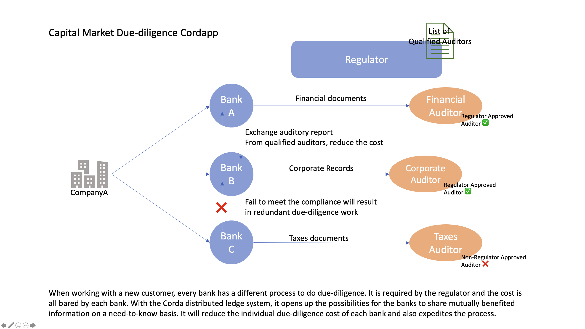

# due-diligence-cordapp
<p align="center">
  
</p>

## Pre-running the app

Deploying nodes: `./gradlew clean deployNodes`

Starting the nodes: `./build/nodes/runnodes`

Uploading whitelisted Auditors: `./gradlew uploadWhitelists`


## Running the Cordapp
Step #1: At PartyA, file the original Corporate Records auditing process with Auditor(Trusted Auditor)
```
flow start RequestToValidateCorporateRecordsInitiator validater: Trusted Auditor, numberOfFiles: 10
```

Step #2: Go to the Trusted Auditor Node, validate the auditing request(This step symbolize the auditing process by this third party auditor). Put in the linearId which was returned in Step #1.
```
flow start ValidateCorporateRecordsInitiator linearId: <XXXX-XXX-XXXX-XXXXX-XXXXXX>
```

Step #3: Go to PartyA, Do a query to confirm that the request has been validated. You should see the variable `qualification=true`. 

```
run vaultQuery contractStateType: net.corda.samples.duediligence.states.CorporateRecordsAuditRequest
```
Then, we will instruct PartyA to share a copy of the auditing result with PartyB: (Again, You would need put in the linearId returned from Step #1). The parameter `trustedAuditorAttachment` is a jar file which records the trusted auditors. If PartyA used an untrusted auditor to accquire the corporate records auditing report. He will be prohibited to share with anyone because it is valueless effort(in this business use case, Of course you can modify the business use cases).
```
flow start ShareAuditingResultInitiator AuditingResultID: <XXXX-XXX-XXXX-XXXXX-XXXXXX>, sendTo: BankB, trustedAuditorAttachment: "8DF3275D80B26B9A45AB022F2FDA4A2ED996449B425F8F2245FA5BCF7D1AC587"
```
This flow will return the LinearId of the copy of auditing report, you would need this in Step #6. 

Step #4: Go to PartyB, do a query to confirm the delievery of copy of the Auditing Report.
```
run vaultQuery contractStateType: net.corda.samples.duediligence.states.CopyOfCoporateRecordsAuditRequest
```
As of now, the sharing of the trusted auditing report is done. What left now for both PartyA and PartyB in this use case is to upload the Corporate Records auditing report into a due-diligence list, which they can share with a regulator.(You can again alter this step to suit any other use cases). 


Step #5: Go to PartyA, Attach the Corporate Records auditing report into a due-diligence checklist and report to the Regulator. Again, the approvalId is the linearId returned in Step #1.
```
flow start CreateCheckListAndAddApprovalInitiator reportTo: Regulator, approvalId: <XXXX-XXX-XXXX-XXXXX-XXXXXX>
```
Step #6: Go to PartyB, Attach the copy of the Corporate Records auditing report into a due-diligence checklist and report to the Regulator. You would need the linearId that is return from Step #5
```
flow start CreateCheckListAndAddApprovalInitiator reportTo: Regulator, approvalId: <XXXX-XXX-XXXX-XXXXX-XXXXXX-Returned-From-Step #5>
```
Step #7: Go to Regulator, do a query on reported due-diligence checklists. You will be able to see both PartyA and PartyB had filed a due-diligence checklist.
```
run vaultQuery contractStateType: net.corda.samples.duediligence.states.DueDChecklist

```
This use of Distributed technology Corda helped PartyB saved the cost of go through corporate records due-diligence process while still reaching a trusted auditing report. 
