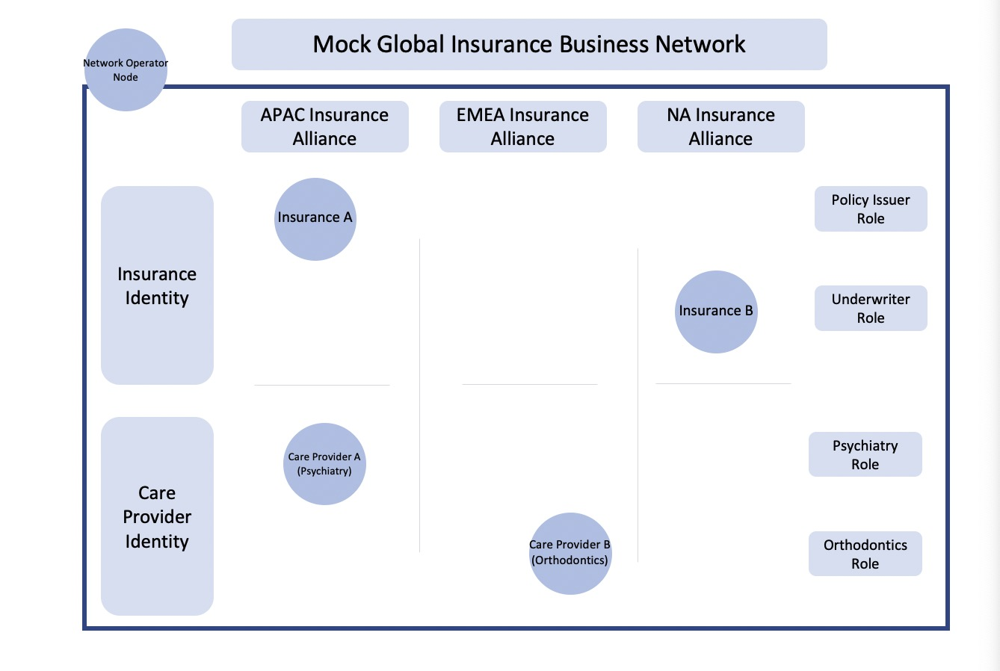

# Insurance Business Network


This sample will show you how to deploy and manage a business network. Our example use case is a mock insurance consortium. 

<p align="center">
  
</p>

### Concept:
In this app, we will have a global insurance network, where participants are either insurance companies or different kind of health care providers.
With the help of business network extension, we can further breakdown the global network into smaller pieces as groups, such as APAC_Insurance_Alliance.

In our sample, we will have three nodes, named as:
* NetworkOperator <- Business Network Operator
* Insurance <- Insurance Company that is in the network
* CarePro <- Care Provider of the network

The NetworkOperator will be create and primarily manage the network. As introduced in the SDK docs, NetworkOperator will be the default authorized user of this global network. And the other two nodes will fill the roles which can be easily tell by its name.

#### The corDapp will run with the following steps:
1. Network creations by NetworkOperator
2. The rest of the nodes request join the network
3. The NetworkOperator will query all the request and active the membership status for the other nodes.
4. The NetworkOperator will then create a sub group out of the global insurance network called APAC_Insurance_Alliance, and include the two other nodes in the network.
5. The NetworkOperator will then assign custom network identity to the nodes. The insurer node will get an insurance identity, the carePro node will get a health care provider identity.
6. Custom network identity comes with custom roles. We will give the insurer node a policy.
   As of now, the network setup is done. The very last step is to run a transaction between the insurer and the carePro node

### Usage

#### Running the CorDapp

Open a terminal and go to the project root directory and type: (to deploy the nodes using bootstrapper)
```
./gradlew clean deployNodes
```
Then type: (to run the nodes)
```
./build/nodes/runnodes
```
#### Interacting with the CorDapp

**Step 1:** Create the network in NetwprkOperator's terminal
```
flow start CreateNetwork
```
Sample output: 
```
Mon Apr 12 10:35:47 EDT 2021>>> flow start CreateNetwork

 ✅   Starting
➡️   Done
Flow completed with result: 
A network was created with NetworkID: 121577cf-30bf-4e20-9c7d-97f0b4628b06  <- This is what you need in Step 2
```
**Step 2:** 2 non-member makes the request to join the network. Fill in the networkId with what was return from Step1
```
flow start RequestMembership authorisedParty: NetworkOperator, networkId: <xxxx-xxxx-NETWORK-ID-xxxxx>
```
**Step 3:** go back to the admin node, and query all the membership requests.
```
flow start QueryAllMembers
```
**Step 4:** In this step, Network Operator will active the pending memberships
Insurance: fill in the Insurance node MembershipId that is display in the previous query
```
flow start ActiveMembers membershipId: <xxxx-xxxx-INSURANCE-ID-xxxxx>
```
CarePro: fill in the CarePro node MembershipId that is display in the previous query
```
flow start ActiveMembers membershipId: <xxxx-xxxx-CAREPRO-ID-xxxxx>
```

**Step 5:** Admin create subgroup and add group members. 
```
flow start CreateNetworkSubGroup networkId: <xxxx-FROM-STEP-ONE-xxxxx>, groupName: APAC_Insurance_Alliance, groupParticipants: [<xxxx-NETWORKOPERATOR-ID-xxxxx>, <xxxx-xxxx-INSURANCE-ID-xxxxx>, <xxxx-xxxx-CAREPRO-ID-xxxxx>]
```
**Step 6:** Admin assign business identity to a member. 
```
flow start AssignBNIdentity firmType: InsuranceFirm, membershipId: <xxxx-xxxx-INSURANCE-ID-xxxxx>, bnIdentity: APACIN76CZX
```
**Step 7:** Admin assign business identity to the second member 
```
flow start AssignBNIdentity firmType: CareProvider, membershipId: <xxxx-xxxx-CAREPRO-ID-xxxxx>, bnIdentity: APACCP44OJS
```
**Step 8:** Admin assign business identity related ROLE to the member.
```
flow start AssignPolicyIssuerRole membershipId: <xxxx-xxxx-INSURANCE-ID-xxxxx>, networkId: <xxxx-xxxx-NETWORK-ID-xxxxx>
```
Now to see our membership states, we can run these vault queries. 
```
run vaultQuery contractStateType: net.corda.core.contracts.ContractState
run vaultQuery contractStateType: net.corda.bn.states.MembershipState
```
-------------------Network setup is done, and business flow begins--------------------------

**Step 9:** The insurance Company will issue a policy to insuree. The flow initiator (the insurance company) has to be a member of the Business network, has to have a insuranceIdentity, and has to have issuer Role, and has to have issuance permission.
```
flow start IssuePolicyInitiator networkId: <xxxx-xxxx-NETWORK-ID-xxxxx>, careProvider: CarePro, insuree: PeterLi
```
**Step 10:** Query the state from the CarePro node.
```
run vaultQuery contractStateType: net.corda.samples.businessmembership.states.InsuranceState
```
