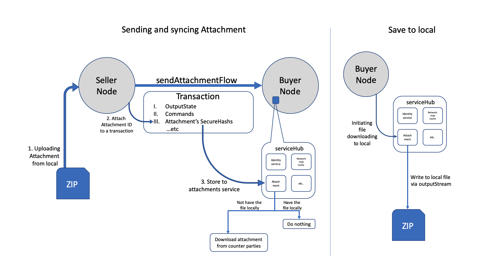

## Feature Specific Cordapps

This folder features several sample projects, each of them demonstrates different specific features of corda.

### [Blacklist -- Attachment](./attachment-blacklist):
This CorDapp allows nodes to reach agreement over arbitrary strings of text, but only with parties that are not included in the blacklist uploaded to the nodes as an [attachment](https://training.corda.net/corda-details/attachments/).  

### [Sendfile -- Attachment](./attachment-sendfile):
This Cordapp shows how to upload and download an [attachment](https://training.corda.net/corda-details/attachments/) via a flow.  

  

### [Whistleblower -- Confidential Identity ](./confidentialidentity-whistleblower):
This CorDapp is a simple showcase of [confidential identities](https://docs.corda.net/docs/corda-os/api-identity.html#confidential-identities) (i.e. anonymous public keys).  

### [Autopayroll -- CordaService](./cordaservice-autopayroll):
This Cordapp shows how to trigger a flow with vault update(completion of prior flows) using [CordaService](https://training.corda.net/corda-details/automation/#services) & [trackby](https://training.corda.net/corda-details/automation-solution/#track-and-notify).  

  

### [Trade Reporting -- ObservableStates](./observablestates-tradereporting):
This CorDapp shows how Corda's [observable states](https://docs.corda.net/docs/corda-os/4.4/tutorial-observer-nodes.html#observer-nodes) feature works. Observable states is the ability for nodes who are not participants in a transaction to still store them if the transactions are sent to them.  

### [Prime Number -- Oracle](./oracle-primenumber):
This CorDapp implements an [oracle service](https://training.corda.net/corda-details/oracles) that allows nodes to:

* Request the Nth prime number
* Request the oracle's signature to prove that the number included in their transaction is actually the Nth prime number  

### [Car Insurance -- QueryableState](./queryablestate-carinsurance):
This CorDapp demonstrates [QueryableState](https://docs.corda.net/docs/corda-os/api-persistence.html) works in Corda. Corda allows developers to have the ability to expose some or all parts of their states to a custom database table using an ORM tools. To support this feature the state must implement `QueryableState`.  

### [Sanctionsbody -- ReferenceStates](./referencestates-sanctionsbody):
This CorDapp demonstrates the use of [reference states](https://training.corda.net/corda-details/reference-states/) in a transaction and in the verification method of a contract.

This CorDapp allows two nodes to enter into an IOU agreement, but enforces that both parties belong to a list of sanctioned entities. This list of sanctioned entities is taken from a referenced SanctionedEntities state.  

### [Heartbeat -- SchedulableState](./schedulablestate-heartbeat):
This CorDapp is a simple showcase of [scheduled activities](https://docs.corda.net/docs/corda-os/event-scheduling.html#how-to-implement-scheduled-events) (i.e. activities started by a node at a specific time without direct input from the node owner).  

  

