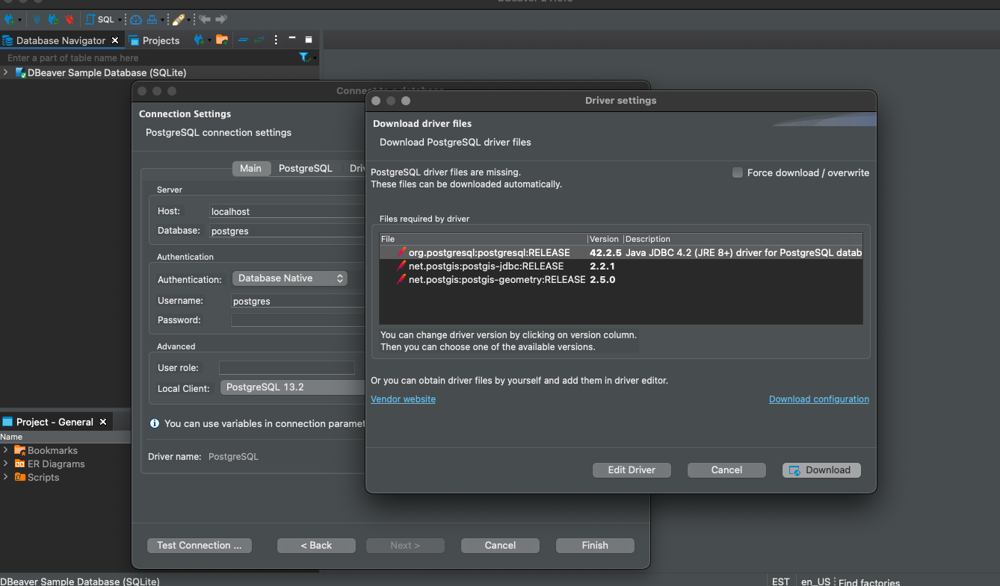

# Postgres Cordapp

The latest versions of Corda Open Source support H2 and Postgres.H2 is the default database while this application will
demonstrate to you how to run corda with a postgres. The cordapp being used is another copy of the yo cordapp, as the
majority of the work here is in simply configuring the sql database connection.

## Pre-Requisites

See https://docs.corda.net/getting-set-up.html.

## Usage

### Running the sample

Start with provisioning the database:

```sh
docker run --name postgres_for_corda -e POSTGRES_PASSWORD=test -d -p 5432:5432 postgres:11

# run sql scripts locally on the postgres instance to configure it for use
cat config.sql | docker exec -i postgres_for_corda psql -h localhost -p 5432 -U postgres

./gradlew deployNodes

./build/nodes/runnodes
```

You can then look for the shell for PartyA and run your flows.

```sh
Thu Apr 22 13:03:05 EDT 2021>>> flow start net.corda.samples.postgres.flows.YoFlow target: PartyB

 ✅   Starting
 ✅   Creating a new Yo!
 ✅   Signing the Yo!
 ✅   Verifying the Yo!
 ✅   Sending the Yo!
          Requesting signature by notary service
              Requesting signature by Notary service
              Validating response from Notary service
     ✅   Broadcasting transaction to participants
➡️   Done
Flow completed with result: SignedTransaction(id=8B3FC06F685FC8FFD29001CC6205DAECBFF436E28E0439F74F5A89D11372C578)
```

### useful commands for interacting with your postgres container

Here's a couple convenient postgres commands to get you started.

```sh
# to list all databases
docker exec -i postgres_for_corda psql -U postgres -p 5432 -h localhost postgres -c "\l"

# to make sure that the schemas were added to the database
docker exec -i postgres_for_corda psql -U postgres -p 5432 -h localhost postgres -c "\dn"

# show all roles
docker exec -i postgres_for_corda psql -U postgres -p 5432 -h localhost postgres -c "\dg"
```

### Connencting to your database with dbeaver

You can connect to your db with all kinds of tools like dbeaver, just open up a new connection, specify `postgreSQL` in
the search bar.

The default username we provided in the command above is `postgres` and the password is `test`.



You can then open the schema editor and try running a couple queries:

```sql
-- show all schemas
SELECT schema_name
FROM information_schema.schemata;
```


### Troubleshooting

You may run into some errors about node identity when running 'deployNodes', this is because the database will already
have the node information, so you will want to make sure to clear the database contents so that you don't run into
issues when recompiling the nodes.

## Additional Resources

- https://www.corda.net/blog/cordapp-database-setup-development-perspective/
- https://medium.com/corda/cordapp-database-setup-production-perspective-2c400e60fae5
