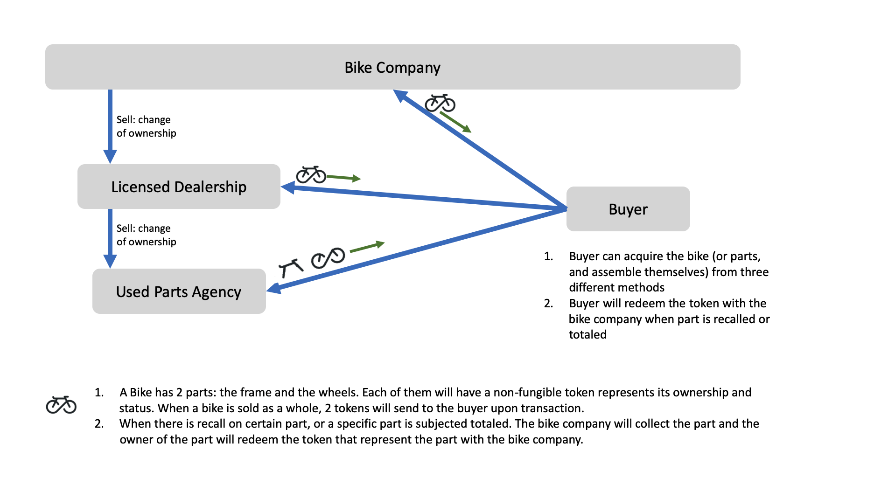

# bike market - tokensdk

In this sample CorDapp we will mimic a bike buying and selling market.


## Concepts


### Parties

This sample CorDapp demonstrates some simple flows related to the Token SDK. In this CorDapp there are four parties:

- The Bike Company (BikeCo): can manufacture, sell, and recall/total the bikes (or parts).
- The Licensed Dealership: can buy the bikes from the BikeCo.
- Used Parts Agency: can buy used parts from the Licensed Dealership (or end-buyers).
- Buyer: can buy the bikes from the BikeCo or licensed dealership, or buy used parts from used parts agency.




From the above diagram we see that Tokens are representing the ownership and status of the physical assets, such as the bike frame 
and bike wheels. A key point to notice here is that **a bike is represented with 2 Tokens (Frame and wheels)**. This is designed 
to be flexible to sell or total a specific part of your bike. As can be seen, this bike buying/selling market is capable 
of mimicking multiple business logic flows. We will be demonstrating one of the possible logic flows here:

1. BikeCo manufactures the bikes.
2. BikeCo can sell the bike to licenced dealership and buyers.
3. Used parts agency can get the used bike parts from the licenced dealership or buyers.
4. When there is a need to total a physical bike part, the current owner of the physical part will redeem the Token with the BikeCo.

Throughout the sample, we will see how to create, transact, and redeem a Token.


### Flows


We'll create bike parts using the flows for CreateFrameToken and CreateWheelToken.


We can create the Tokens with [CreateFrameToken](./workflows/src/main/java/net/corda/examples/bikemarket/flows/CreateFrameToken.java) and [CreateWheelToken](./workflows/src/main/java/net/corda/examples/bikemarket/flows/CreateWheelToken.java).


We'll create a bike with the [IssueNewBike](./workflows/src/main/java/net/corda/examples/bikemarket/flows/IssueNewBike.java) flow.


We can transfer bike Tokens using the [TransferBikeToken](./workflows/src/main/java/net/corda/examples/bikemarket/flows/TransferBikeTokens.java) flow.


We can total bike Tokens using the [TotalPart](./workflows/src/main/java/net/corda/examples/bikemarket/flows/TotalParts.java) flow.


We can transfer part Tokens using the [TransferPartToken](./workflows/src/main/java/net/corda/examples/bikemarket/flows/TransferPartTokens.java) flow.


## Usage

### Running the sample

Deploy and run the nodes by:
```
./gradlew deployNodes
./build/nodes/runnodes
```
if you have any questions during setup, please go to https://docs.corda.net/getting-set-up.html for detailed setup instructions.

Once all four nodes are started up, in BikeCo's node shell, run:
```
flow start CreateFrameToken frameSerial: F4561
flow start CreateWheelToken wheelSerial: W7894
```
After this step, we have created 2 Tokens representing the physical bike part with unique serial number (which will be unique in the manufacturing).
Then run:
```
flow start IssueNewBike frameSerial: F4561, wheelSerial: W7894, holder: LicensedDealership
```
This line of command will transfer the Tokens (2 Tokens together represents a single bike) to the licensed dealership.

Now, at the licensed dealership's shell, we can see we did receive the Tokens by running:
```
run vaultQuery contractStateType: com.r3.corda.lib.tokens.contracts.states.NonFungibleToken
```
Continue to the business flow, the licensed dealership will sell the bike to the Buyer. Run:
```
flow start TransferBikeToken frameSerial: F4561, wheelSerial: W7894, holder: Buyer
```

Now we can check at the Buyer's node shell to see if the buyer received the Token by running the same `vaultQuery` we just ran at the dealership's shell.

At the Buyer side, we can assume we get a recall notice and will send the physical bike frame back to the manufacturer. The action will happen in real life, 
but on the ledger we will also need to "destroy" (process of redeem in Corda Token SDK) the frame Token. Run:
```
flow start TotalPart part: frame, serialNumber: F4561
```
At the buyer's shell, if we do the [vaultQuery](https://docs.corda.net/docs/corda-os/api-vault-query.html#api-vault-query) again, we will see we now only have a wheel Token (the frame Token is gone). With the wheel Token, we can sell 
this pair of wheels to the used parts agency. We will achieve it by running:
```
flow start TransferPartToken part: wheel, serialNumber: W7894, holder: UsedPartsAgency
```
At the end of the flow logic, we will find the frame Token is destroyed and the used parts agency holds the wheel Token.

