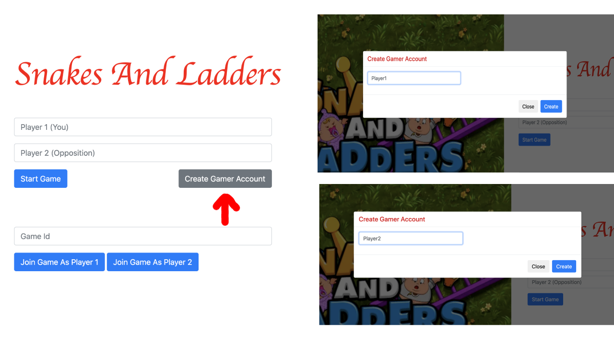

# Snakes And Ladders

This sample implements a simple Snakes And Ladder Game on Corda.

It's a simple game which has a board with numbers from 1 to 100. Each player starts at 1. 
Players take turn to roll a dice and move as many places as they rolled. If a player lands on a number 
with a ladder they climb up using the ladder or if they land in a number with a snake they move down on the board.
The player who reach 100 first wins.

The CorDapp runs  a network having 4 nodes, 
1. Classic Games
2. Mega Games
3. Oracle
4. Notary

Each player can create an account to participate. Players can either be on the same node or different nodes. 
Oracle node is used to obtain the player dice rolls.

# Setting up
Go into the project directory and build the project
```
./gradlew clean deployNodes
```
Run the project
```
./build/nodes/runnodes
```

Now, you should have four Corda terminals opened automatically.

Run the below command to start clients:

``` ./gradlew runClassicGamesClient```

``` ./gradlew runMegaGamesClient```

The clients can be accessed at http://localhost:50007 and http://localhost:50008 for Classic Games and Mega Games respectively.

# Running the Sample CorDapp

1. Goto http://localhost:50007/
2. Click the "Create Game Account" to create account for players. Create two accounts say "Player1" and "Player2".
    
3. To State the Game enter the player's name in Player 1 and Player 2 field and click on "Start Game" button.
4. The game is now started.
    
5. Player two can join from a different browser window by using the "Join Game as Player 2" button on the landing screen.
   The Game Id can be found in the Game screen.
6. Each player need to roll the dice till one of them reaches 100. The one who reaches 100 first becomes the winner.   


