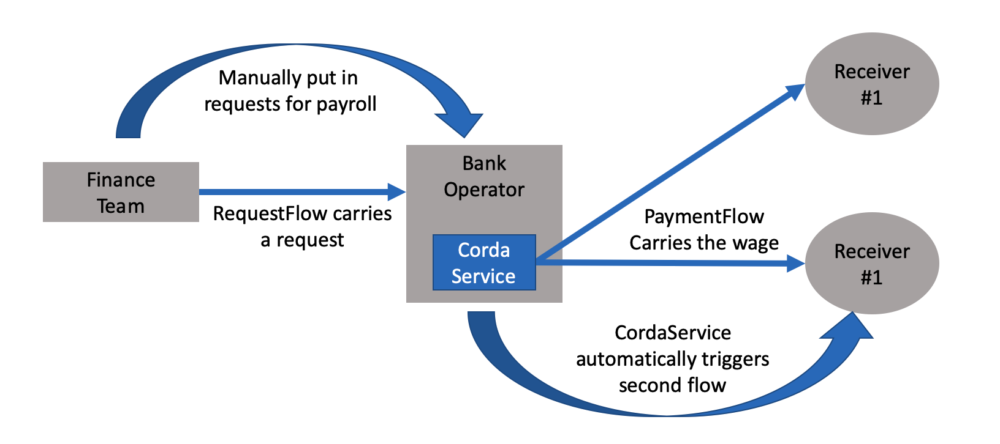

# Auto Payroll -- CordaService

This CorDapp shows how to trigger a flow with vault update(completion of prior flows) using [CordaService](https://training.corda.net/corda-details/automation/#services).

## Concepts

In this CorDapp, there are four parties:
 - Finance Team: gives payroll order
 - Bank Operator: takes the order and automatically initiate the money transfer
 - PetersonThomas: worker #1 accepts money
 - GeorgeJefferson: worker #2 accepts money

There are two states `PaymentRequestState` & `MoneyState`, and two flows `RequestFlow` & `PaymentFlow`. The business logic looks like the following:


1. Finance team put in payroll request to the bank operators
2. Bank operator receives the requests and process them without stopping


## Usage


## Pre-Requisites

For development environment setup, please refer to: [Setup Guide](https://docs.r3.com/en/platform/corda/4.10/community/getting-set-up.html).

### Running the CorDapp

Open a terminal and go to the project root directory and type: (to deploy the nodes using bootstrapper)
```
./gradlew clean build deployNodes
```
Then type: (to run the nodes)
```
./build/nodes/runnodes
```

Once all four nodes are started up, in FinanceTeam's node shell, run:
```
flow start RequestFlowInitiator amount: 500, towhom: GeorgeJefferson
```
As a result, we can check for the payment at GeorgeJefferson's node shell by running:
```
run vaultQuery contractStateType: net.corda.samples.autopayroll.states.MoneyState
```
We will see that George Jefferson received a `MoneyState` with amount $500.

Behind the scenes, upon the completion of `RequestFlow`, a request state is stored at Bank operator's vault. The CordaService vault listener picks up the update and calls the `paymentFlow` automatically to send a `moneyState` to the designed reciever.

### Flow triggering using CordaService

The CordaService that triggers the flow is defined in [AutoPaymentService.java](./workflows/src/main/java/net/corda/samples/autopayroll/flows/AutoPaymentService.java). The `CordaService` annotation is used by Corda to find any services that should be created on startup. In order for a flow to be startable by a service, the flow must be annotated with @StartableByService. An example is given in PaymentFlow.kt.
You probably have noticed that `paymentFlow` is not tagged with `@StartableByRPC` like flows normally are. That is, it will not show up in the node shell's flow list. The reason is that `paymentflow` is a completely automated process that does not need any external interactions, so it is ok to be "not-been-seen" from the RPC.

That said, CordaService broadly opens up the probabilities of writing automated flows and fast responding CorDapps!
