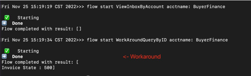

# Workaround over a bug in shareStateWithAccount flow

For More information regarding the Accounts Library, please read at: https://github.com/corda/accounts/blob/master/docs.md

This CorDapp is only a demo for the workaround solution of not able to query the states that were shared via `shareStateWithAccount` flow. 

# Setting up
Go into the project directory and build the project
```
./gradlew clean deployNodes
```
Run the project
```
./build/nodes/runnodes
```
Now, you should have four Corda terminals opened automatically.

# Shell Instructions (Part 1) - Creating & Sharing Accounts
Go to the Buyer's node terminal and paste in the following code: (You can select all 7 lines and copy to the terminal all at once)
```
flow start CreateNewAccount acctName: BuyerProcurement
flow start CreateNewAccount acctName: BuyerFinance

flow start ShareAccountTo acctNameShared: BuyerProcurement, shareTo: Seller
flow start ShareAccountTo acctNameShared: BuyerFinance, shareTo: Seller
```
This is creating 3 accounts under Buyer's node and sharing with their specific conterpartie's node or account.

Go to the Seller's node terminal and paste in the following code: 
```
flow start CreateNewAccount acctName: SellerSales
flow start CreateNewAccount acctName: SellerFinance

flow start ShareAccountTo acctNameShared: SellerSales, shareTo: Buyer
flow start ShareAccountTo acctNameShared: SellerFinance, shareTo: Buyer
```
This is creating 3 accounts under Seller's node and sharing with their specific conterpartie's node or account.

[Optional]: You can run a vaultQuery to see the [AccountInfo](https://training.corda.net/libraries/accounts-lib/#design) that been stored at each node by using: 
```
run vaultQuery contractStateType: com.r3.corda.lib.accounts.contracts.states.AccountInfo
```
# Shell Instructions (Part 2) - Executing Business Flows
## Step 1: Seller's sales team send inovice of $500 to Buyer's procurement team
navigate to Seller's node terminal and run
```
flow start SendInvoice whoAmI: SellerSales, whereTo: BuyerProcurement, amount: 500 
```
[Optional]: If you would like to verify the message had been successfully pass into Buyer's procurement team, you can navigate to Buyer's node terminal and type in: 
```
flow start ViewInboxByAccount acctname: BuyerProcurement
```
-------
The above steps are the base steps of running an account to account transaction, The following steps are showing how to 
share state to a non-relevant account. Run the following commands at Seller Node
```
run vaultQuery contractStateType: net.corda.samples.supplychain.states.InvoiceState
flow start SendToNonParticipantAcct whoAmI: SellerSales, whereTo: BuyerFinance, stateId: XXXXX-XXXX-XXXX-XXXXX (This is the state ID from the query)
```
Now we go to the buyer node: if we run 
```
flow start ViewInboxByAccount acctname: BuyerFinance (This will NOT work due to a bug).
```
The workaround is using a different query flow called `accountObservedQueryBy`
```
flow start WorkAroundQueryByID acctname: BuyerFinance
```


Some temporary utilities have been provided to help you with this. See: [accountObservedQueryBy] and [accountObservedTrackBy].


