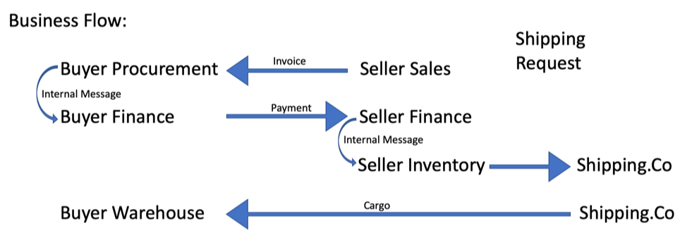

# Accounts_SupplyChain

For more information regarding the Accounts Library, please read: https://github.com/corda/accounts/blob/master/docs.md

This sample describes a mock/simple supply chain business flow.

<p align="center">
  
</p>

From the above chart, you can see the flow is going back and forth between different parties' accounts. Please follow the instruction below to experience the [Accounts](https://training.corda.net/libraries/accounts-lib/) library. 

# Setting up
Go into the project directory and build the project
```
./gradlew clean build deployNodes
```
Run the project
```
./build/nodes/runnodes
```
Now, you should have four Corda terminals opened automatically.

# Shell Instructions (Part 1) - Creating & Sharing Accounts
Go to the Buyer's node terminal and paste in the following code: (You can select all 7 lines and copy to the terminal all at once)
```
flow start CreateNewAccount acctName: BuyerProcurement
flow start CreateNewAccount acctName: BuyerFinance
flow start CreateNewAccount acctName: BuyerWarehouse

flow start ShareAccountTo acctNameShared: BuyerProcurement, shareTo: Seller
flow start ShareAccountTo acctNameShared: BuyerFinance, shareTo: Seller
flow start ShareAccountTo acctNameShared: BuyerWarehouse, shareTo: ShippingCo
flow start ShareAccountTo acctNameShared: BuyerWarehouse, shareTo: Seller
```
This is creating 3 accounts under Buyer's node and sharing with their specific counterparty's node or account.

Go to the Seller's node terminal and paste in the following code: 
```
flow start CreateNewAccount acctName: SellerSales
flow start CreateNewAccount acctName: SellerFinance
flow start CreateNewAccount acctName: SellerInventory

flow start ShareAccountTo acctNameShared: SellerSales, shareTo: Buyer
flow start ShareAccountTo acctNameShared: SellerFinance, shareTo: Buyer
flow start ShareAccountTo acctNameShared: SellerInventory, shareTo: ShippingCo
```
This is creating 3 accounts under Seller's node and sharing with their specific counterparty's node or account.

[Optional]: You can run a vaultQuery to see the [AccountInfo](https://training.corda.net/libraries/accounts-lib/#design) that been stored at each node by using: 
```
run vaultQuery contractStateType: com.r3.corda.lib.accounts.contracts.states.AccountInfo
```
# Shell Instructions (Part 2) - Executing Business Flows
## Step 1: Seller's sales team sends an invoice for $500 to Buyer's procurement team
navigate to Seller's node terminal and run
```
flow start SendInvoice whoAmI: SellerSales, whereTo: BuyerProcurement, amount: 500 
```
[Optional]: If you would like to verify the message had been successfully pass into Buyer's procurement team, you can navigate to Buyer's node terminal and type in: 
```
flow start ViewInboxByAccount acctname: BuyerProcurement
```
You see that the invoice state amount 500 is returned. You can also replace the BuyerProcurement with BuyerWarehouse to see that the non-relevant accounts has no visibility about the invoice state. 

## Step 2: Buyer's procurement team will send an internal message to Buyer's Buyer's finance team
Navigate to Buyer's node terminal and type in: 
```
flow start InternalMessage fromWho: BuyerProcurement, whereTo: BuyerFinance, message: Send 500 to SellerFinance
```
[Optional verification]: run ```flow start ViewInboxByAccount acctname: BuyerFinance``` at Buyer' node terminal

## Step 3: Buyer's finance team send a payment to Seller's finance team
Navigate to Buyer's node terminal and type in:
```
flow start SendPayment whoAmI: BuyerFinance, whereTo: SellerFinance, amount: 500
```
[Optional verification]: run ```flow start ViewInboxByAccount acctname: SellerFinance``` at Seller's node terminal 

## Step 4: Seller's finance team send an internal message to Seller's inventory team to instruct them to send the cargo
Navigate to Seller's node terminal and type in
```
flow start InternalMessage fromWho: SellerFinance, whereTo: SellerInventory, message: send Cargo to Buyer
```
[Optional verification]: run ```flow start ViewInboxByAccount acctname: SellerInventory``` at Seller's node terminal 

## step 5: Seller's inventory team send a shipping work order for shipping company 
Navigate to Seller's node terminal and type in
```
flow start SendShippingRequest whoAmI: SellerInventory, whereTo: BuyerWarehouse, shipper: ShippingCo, Cargo: 10 boxes of Books
```
[Optional verification]: run ```run vaultQuery contractStateType: com.accounts_SupplyChain.states.ShippingRequestState``` at ShippingCo's node terminal 

## Step 6: Shipping company sends the cargo to Buyer's warehouse
Navigate to ShippingCo's node terminal and type in
```
flow start SendCargo pickupFrom: SellerInventory, shipTo: BuyerWarehouse, cargo: Books
```
[Optional verification]: run ```flow start ViewInboxByAccount acctname: BuyerWarehouse``` at Buyer's node terminal 

## Now, the entire business chain is completed. 


