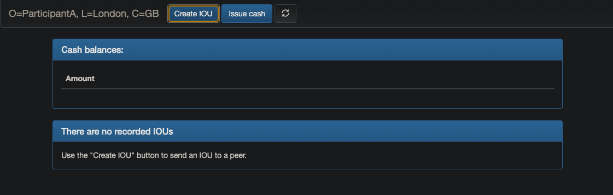
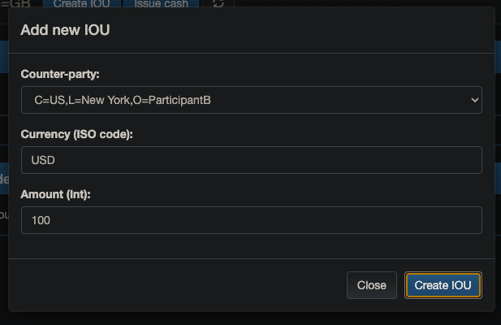
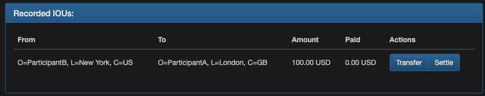

# Obligation Cordapp

This Cordapp is the complete implementation of our signature IOU (I-owe-you) demonstration.

## Concepts

An IOU is someone who has cash that is paying it back to someone they owe it to. You have to have the original concept of the debt itself, (the IOU), and the cash. Then the ability to exchange assets like cash or assets, and then the ability to settle up. Given this is intended to implement an IOU, our cordapp consists of three flows `issue`, `transfer` and `settle` flows.


### Flows

The first flows are the ones that issue the original cash and assets. You can find that the cash flow at `SelfIssueCashFlow.kt` and the IOU issurance in `IOUIssueFlow.kt`.

The next flow is the one that transfers ownership of that asset over to another party. That can be found in `IOUTransferFlow.kt`.


Finally, once we have the ability to transfer assets, we just need to settle up. That functionality can be found here in `IOUSettleFlow.kt`


## Pre-Requisites
[Set up for CorDapp development](https://docs.r3.com/en/platform/corda/4.9/community/getting-set-up.html)

## Usage

### Running the CorDapp

Once your application passes all tests in `IOUStateTests`, `IOUIssueTests`, and `IOUIssueFlowTests`, you can run the application and
interact with it via a web browser. To run the finished application, you have two choices for each language: from the terminal, and from IntelliJ.

Open a terminal and go to the project root directory and type: (to deploy the nodes using bootstrapper)
```
./gradlew clean build deployNodes
```
Then type: (to run the nodes)
```
./build/nodes/runnodes
```

### Starting the webserver
Once the nodes are up, we will start the webservers next. This app consists of three nodes and one notary, so we will be starting 3 webservers separately. First, lets start PartyA's webserver. Open a new tab of the terminal (make sure you are still in the project directory) and run:
```
./gradlew runPartyAServer
```
repeat the same for PartyB and PartyC, run each of the commands in a new tab:
```
./gradlew runPartyBServer
```
and
```
./gradlew runPartyCServer
```

### Interacting with the CorDapp in the browser

Once all the three servers have started up (look for `Webserver started up in XXX sec` in the terminal), you can interact with the app via a web browser.
* From a Node Driver configuration, look for `Starting webserver on address localhost:100XX` for the addresses.

* From the terminal: Node A: `localhost:10009`, Node B: `localhost:10012`, Node C: `localhost:10015`.

To access the front-end gui for each node, navigate to `localhost:XXXX`

1. Navigate to Node A in the browser: `localhost:10009`. Click on the `Create IOU` button:



2. Fill in the fields as shown in the screenshot below:



3. After a couple of seconds, you should see a popup with a `Transaction id` - which means the issue flow has successfully completed.
4. Click out of the popup and refresh the browser page for Party A node. You should see that the IOU we just created is now visible under the `Recorded IOUs` section:  



5. Go to the browser page for Party B node. If you refresh the page, you should see that the same IOU we just created also under the `Recorded IOUs` section.
6. However, if you navigate to the browser page for Party C node, this IOU is not visible. This is because the transaction was only between Party A and Party B. Therefore, Party C does not have the IOU state recorded in its vault.

### Interaction with the CorDapp in the terminal

Let's take a look at the IOU states we just created, in the terminal.

1. Navigate to Party A's Corda Interactive Shell in the terminal and type:
```
run vaultQuery contractStateType: net.corda.samples.obligation.states.IOUState
```

The output of this vault query returns the IOU state which we just created.

2. Navigate to Party B's Corda Interactive Shell in the terminal and type:
```
run vaultQuery contractStateType: net.corda.samples.obligation.states.IOUState
```

You should see exactly the same IOU state as the output.

3. And now if you type in the same vault query command into Party C's Corda Interactive Shell, it should return nothing as Party C's vault does not include the IOU State we just created. This is the expected behaviour as information is only shared on a need-to-know basis in Corda.