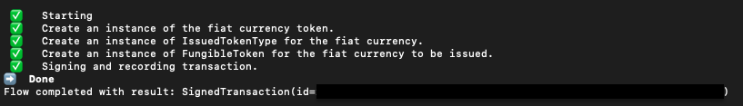
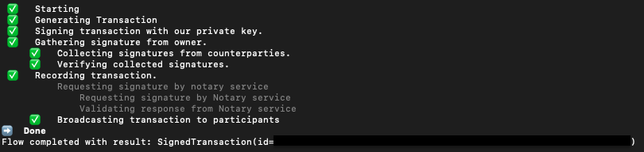
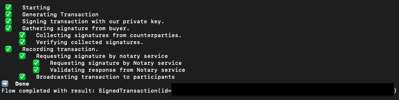
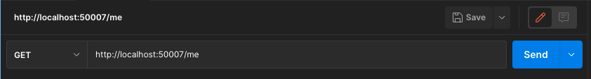
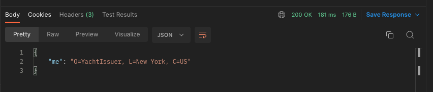

# Superyacht CorDapp

This Superyacht CorDapp allows the creation, issuance, and purchase of yachts on the ledger.
This example also integrates TokenSDK to issue fiat currency to the buyer so that they can purchase the desired yacht. 

There are 4 main parties in this example:
1. Bank
2. Yacht Issuer
3. Yacht Owner (Party A)
4. Yacht Buyer (Party B)


## State
* `YachtState`: This is an [OwnableState](https://docs.r3.com/en/platform/corda/4.9/community/api-states.html#ownablestate) and a [LinearState](https://docs.r3.com/en/platform/corda/4.9/community/api-states.html#linearstate) that represents a Yacht that can be issued by the Yacht Issuer to the Yacht Owner (Party A).

## Contract
* `YachtContract`: This is used to govern the evolution of a `YachtState`. This file includes validation rules governing the `Create` and `Purchase` command for YachtState

## Flows
* `IssueFiatCurrencyFlow`: This flow is used by the Bank to create and to issue a [Fiat Currency Token](https://github.com/corda/token-sdk/blob/master/workflows/src/main/kotlin/com/r3/corda/lib/tokens/money/FiatCurrency.kt) to the Yacht Buyer (Party B). It takes 3 arguments as the parameters: `currency` (String), `amount` (Long), and `recipient` (Party).
* `CreateAndIssueYachtStateFlow`: This flow is used by the Yacht Issuer to create and to issue a `YachtState` to the Yacht Owner (Party A). 
* `PurchaseYachtFlow`: This flow is used process the purchase of a `YachtState` (owned by the Yacht Owner - Party A) in exchange for [Fiat Currency Token](https://github.com/corda/token-sdk/blob/master/workflows/src/main/kotlin/com/r3/corda/lib/tokens/money/FiatCurrency.kt) (owned by the Yacht Buyer - Party B).

## Pre-Requisites

[Please ensure that your device is set up for CorDapp development](https://docs.r3.com/en/platform/corda/4.9/community/getting-set-up.html)


## Running the nodes

1. Open the terminal and go to the project root directory and type:
```
./gradlew clean build deployNodes
```

2. Once the above command has finished running and the build is successful, type:
```
./build/nodes/runnodes
```
This should open up 5 new tabs in the terminal window with Corda interactive shells.

One for the Notary, one for Bank, one for Yacht Issuer, one for Party A, and one for Party B.
(If any of the nodes is missing a Corda interactive shell, from the root folder, navigate to ```./build/node/{missing party node}``` and run ```java -jar corda.jar``` to boot up the Corda interactive shell manually.)

## Interacting with the nodes

### Via the Corda Interactive Shell

When started via the command line, each node will display an interactive shell:

    Welcome to the Corda interactive shell.
    Useful commands include 'help' to see what is available, and 'bye' to shut down the node.
    
    Tue Nov 06 11:58:13 GMT 2018>>>

1. First we need to create and issue some Fiat Currency Tokens to the Yacht Buyer (Party B). The Bank will take on the responsibility and initiate this flow. In the Bank's Corda Interactive Shell, type:
```
flow start IssueFiatCurrencyFlow currency: "USD", amount: 600000000, recipient: PartyB
```
Once this flow has completed, you should see the following:



2. To check that this has successfully been issued to Party B, we need to navigate to Party B's interactive shell and type:
```
run vaultQuery contractStateType: com.r3.corda.lib.tokens.contracts.states.FungibleToken
```
You should be able to see that in the output, there is the Fiat Currency Token that the Bank just created and issued to Party B.

3. Then we need to create and issue a `YachtState` to the Yacht Owner (Party A). The Yacht Issuer will take on the responsibility and initiate this flow. So in the Yacht Issuer's Corda Interactive Shell, type:
```
flow start CreateAndIssueYachtStateFlow$CreateAndIssueYachtStateFlowInitiator owner: PartyA, name: "World Traveller", type: "Motor", length: 18.04, builderName: "Burgess", yearOfBuild: 2009, amount: 100000, currency: USD, forSale: true
```
Once this flow has completed, you should see the following:



4. To check that this `YachtState` has been successfully created and issued to Party A, we need to navigate to Party A's interactive shell and type: 
```
run vaultQuery contractStateType: com.template.states.YachtState
```
You should be able to see that in the output, there is the `YachtState` that the Yacht Issuer just created and issued to Party A. In that output state, you should be able to see the `linear id` field which contains an `id` field. This is the unique identifier for the `YachtState` that the Yacht Issuer has just created. Make a note of this id string as we will need it in the next step. 

5. Now that the Yacht Owner has their `YachtState` and the Yacht Buyer has the `Fiat Currency Token`, let's carry out the yacht purchase. As the owner of the yacht, Party A will take on the responsibility to initiate this flow. In Party A's interactive shell, type:
```
flow start PurchaseYachtFlow$PurchaseYachtFlowInitiator newOwner: PartyB, yachtLinearId: "PASTE-THE-LINEAR-ID-STRING-HERE"
```
Once this flow has completed, you should see the following:



6. To check that the `YachtState` purchase flow has successfully taken place, in Party A's interactive shell, type: 
```
run vaultQuery contractStateType: com.template.states.YachtState
```
This should return an empty array of states as Party A no longer has the Yacht stored in their vault. If you now type:
```
run vaultQuery contractStateType: com.r3.corda.lib.tokens.contracts.states.FungibleToken
```
Party A's vault now contains the amount of Fiat Currency Tokens that Party B has paid for the Yacht.

7. As a final check, let's navigate to Party B's interactive shell and type in the same 2 commands:
```
run vaultQuery contractStateType: com.template.states.YachtState
```
This first command should return the `YachtState` that Party B just purchased from Party A.
```
run vaultQuery contractStateType: com.r3.corda.lib.tokens.contracts.states.FungibleToken
```
This second command should return the remaining amount of Fiat Currency Tokens in Party B's vault, after having purchased the Yacht from Party A.


### Via Postman

Before you start, please make sure you have [Postman](https://www.postman.com/downloads/) downloaded onto your device.

1. With the nodes' Corda Interactive Shells running, open the terminal and go to the project root directory. Open 4 news terminal tabs and type in the following command for each tab:

* Tab 1: ```./gradlew runBankServer```
* Tab 2: ```./gradlew runYachtIssuerServer```
* Tab 3: ```./gradlew runPartyAServer```
* Tab 4: ```./gradlew runPartyBServer```

2. When all the servers are running, navigate to Postman and in `Enter request URL` field, type 
```http://localhost:50007/me``` and click on `Send` (example screenshot below):



You should receive the following response:



`http://localhost:50007` is the RPC endpoint for the Yacht Issuer Server. When we navigate to ```/me``` path, it returns the node's information. 

You can have a try to visit the same ```/me``` path with the Bank Server, Party A Server, and Party B Server.

2. To see how many tokens a party has in their vault, try the ```/my-tokens``` path.
3. To see how many yachts a party has in their vault, try the ```/my-yachts``` path.
4. These two paths might return an empty vault for now if no tokens or yachts have been created/issued yet. In order for the Bank to create and issue Fiat Currency Tokens to Party B, open a new terminal and in the root directory of the project, type:
```
 curl -X PUT "http://localhost:50005/issue-token?amount=60000000&currency=USD&recipient=O=PartyB,L=New%20York,C=US"
```
To check that this PUT request has been successful, go to Postman and request the following URL:
```
http://localhost:50011/my-tokens
```
You should be able to see the Fiat Currency Tokens that the Bank has just created and issued to Party B. 
5. In order for the Yacht Issuer to create and issue a yacht to the Yacht Owner (Party A), type the following command in the terminal we used for the previous `curl` command:
```
curl -X PUT "http://localhost:50007/create-yacht?owner=O=PartyA,L=New%20York,C=US&name=World%20Traveller&type=Motor&length=15.01&builderName=Burgess&yearOfBuild=2009&amount=10000&currency=USD&forSale=true"
```
To check that this PUT request has been successful, go to Postman and request the following URL:
```
http://localhost:50009/my-yachts
```
You should be able to see the `YachtState` that the Yacht Issue has just created and issued to Party A.
Take a note of the `id` string in the `linearId` field, as we will need it in the next step.

6. Now let's carry out the Purchase Yacht Flow. Type the following command in the terminal we used for the previous `curl` commands:
```
curl -X PUT "http://localhost:50009/purchase-yacht?newOwner=O=PartyB,L=New%20York,C=US&yachtLinearId=PASTE-THE-LINEAR-ID-STRING-HERE"
```
Let's check that this PUT request has been successful. Go to Postman and request the following URL:

Party A Vault:
* ```http://localhost:50009/my-yachts``` -> The response should be empty as Party A should not have any `YachtState` in their vault.
* ```http://localhost:50009/my-tokens``` -> The response should have the Fiat Currency Tokens that were paid to Party A from Party B in exchange for the `YachtState`.

Party B Vault:
* ```http://localhost:50011/my-yachts``` -> The response should return the `YachtState` that Party B just purchased from Party A.
* ```http://localhost:50011/my-tokens``` -> The response should return the remaining amount of Fiat Currency Tokens in Party B's vault, after having purchased the `YachtState` from Party A.
