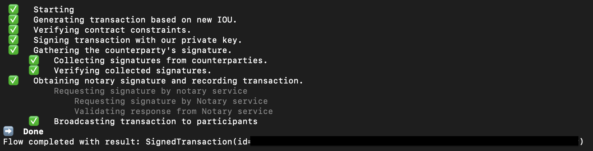

# opentelemetry-cordapp-example 

This example is functionally the same as the cordapp-example. The difference is that this example has been updated slightly to demonstrate opentelemetry.
The files that have changed from the cordapp-example are briefly described below. Only the main changes are described, please review the files to see complete changes.

**gradle.build**  

An extra dependency is included here which when deployNodes is run causes the open telemetry driver file to be copied to the node drivers directory.

**workflows/.../ExampleFlow.kt**

Shown here is an example of creating a span in your own flow. The most important point to note in this example is that spans
cannot be part of a Corda checkpoint, so a map is created that maps uuids to spans with the uuid being checkpointed. Note also that
apart from the call to get the open telemetry handle all other open telemetry code is part of the open telemetry api.

**clients/.../Client.kt**

Shown here is an example of creating a span in a standalone client.

**clients/build.gradle**

Shown in this file is the dependency to the open telemetry driver. Like the corda node an alternative is to attach the opentelemetry
java agent to the client on the command line.

**Copying baggage to tags**

To show the sample baggage created in the client and flow being propagated to tags add the following configuration option to
the node.conf of all nodes.

`
telemetry {
    copyBaggageToTags=true
}
`


As all the functionality is the same, the description below is a copy of the description in the cordapp-example.

This opentelemetry-cordapp-example application allows a party (lender) to issue an IOU to another party (borrower).


## States

* `IOUState`: This is a [LinearState](https://docs.r3.com/en/platform/corda/4.9/community/api-states.html#linearstate) and a [QueryableState](https://docs.r3.com/en/platform/corda/4.9/community/api-states.html#the-queryablestate-and-schedulablestate-interfaces) that represents an IOU that can be issued by one party (lender) to another party (borrower).

## Contracts

* `IOUContract`: This is used to govern the evolution of an IOUState. This file includes validation rules governing the `Create` command for `IOUState`.

## Flows

* `ExampleFlow`: This flow is used to create an `IOUState`. It takes 2 arguments as the parameters: the `iouValue` (Int) and the `otherParty` (Party).

## Pre-requisites:
[Set up for CorDapp development](https://docs.r3.com/en/platform/corda/4.9/community/getting-set-up.html)

## Running the nodes:
1. Open a terminal and go to the project root directory and type: (to deploy the nodes using bootstrapper)
```
./gradlew clean build deployNodes
```
2. Then type: (to run the nodes)
```
./build/nodes/runnodes
```
This should open up 3 new tabs in the terminal window with Corda interactive shells. 

One for the Notary, one for Party A, and one for Party B.
(If any of the nodes is missing a Corda interactive shell, from the root folder, navigate to ```./build/node/{missing party node}``` and run ```java -jar corda.jar``` to boot up the Corda interactive shell manually.)

3. Next, navigate to the Party A Corda interactive shell to start the `ExampleFlow` to issue an IOU (from Party A (lender) to Party B (borrower)). Type the following command:
```
flow start ExampleFlow$Initiator iouValue: 20, otherParty: PartyB
```
You should see the following output in the terminal:



4. To check that you've successfully issued an IOU from Party A to Party B, navigate to the Party B Corda interactive shell to check all of the existing `IOUState` in Party B's vault. Type:
```
run vaultQuery contractStateType: "net.corda.samples.example.states.IOUState"
```
This command will output all the States in Party B's vault which has a contract state type of `IOUState`.

You've now successfully issued an `IOUState` of value 20, from Party A to Party B!


