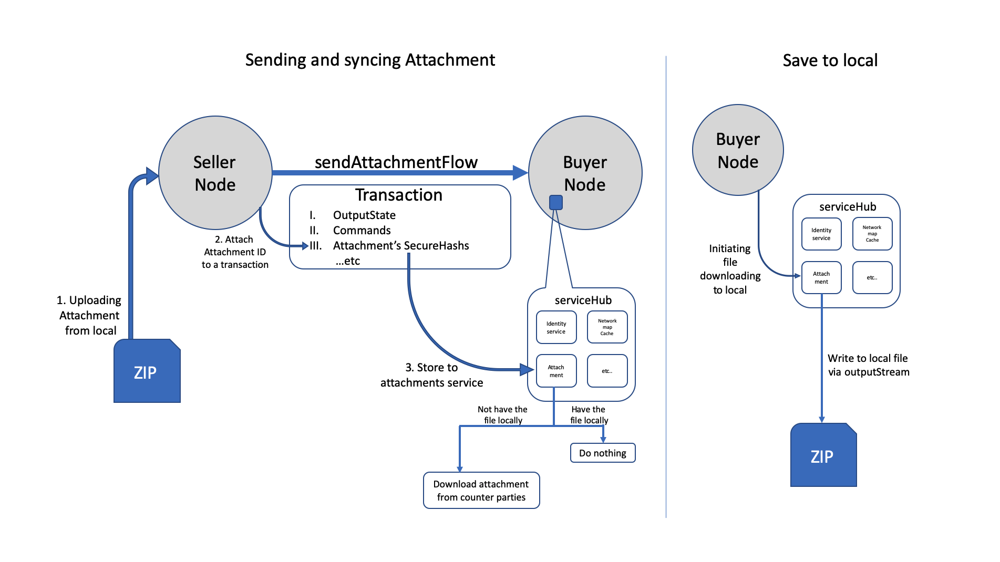

# Sendfile -- Attachment
This CorDapp shows how to upload and download an [attachment](https://training.corda.net/corda-details/attachments/) via flow.


## Concepts

In this CorDapp, there are two parties:
* Seller: sends an invoice (with attachment) to Buyer
* Buyer: receives the invoice and downloads the attached zip file to their local machine


### States

You'll want to take a quick look at `InvoiceState.kt`
(path: `contracts/src/main/kotlin/net/corda/samples/sendfile/states/InvoiceState.kt`)

```kotlin
@BelongsToContract(InvoiceContract::class)
data class InvoiceState(
        val invoiceAttachmentID: String,
        override val participants: List<AbstractParty> = listOf()) : ContractState
```


### Flows

There are two flows `sendAttachment`and `downloadAttachment`.

The flow logic is the following:

* `sendAttachment`: send and sync the attachment between parties
  1. Uploading attachment from local
  2. Attaching the attachmentID to the transaction
  3. Storing the attached file into attachment service at the counterparty's node (Automatically check if it already exists or not. If it does, do nothing; if not, download the attached file from the conterparty.)

* `downloadAttachment`: save the attachment file from node's serviceHub to local
  1. signing the attachment service in the node to download the file via attachmentID




## Usage

## Pre-Requisites

[Set up for CorDapp development](https://docs.r3.com/en/platform/corda/4.9/community/getting-set-up.html)

### Deploy and run the node
```
./gradlew clean build deployNodes
./build/node/runnodes
```

Once all 3 nodes have started up, run the following command in the Seller's interactive node shell:
```
flow start SendAttachment receiver: Buyer
```
Upon completion of this flow, we have now successfully:
1. uploaded a zip file to Seller's node
2. sent the zip file to Buyer's node

Now, lets move to Buyer's interactive node shell, and run:
```
flow start DownloadAttachment sender: Seller, path: file.zip
```
This command is telling the node to retrieve the attachment from the transaction that is sent by `Seller` and download it as `file.zip` at the node root direction. (path: `build/nodes/Buyer/file.zip`)


## Notes:

* This uploaded file is hardcoded into the flow.
* The transaction retrieving is also hardcoded to retrieve the first state that being stored in the vault.

