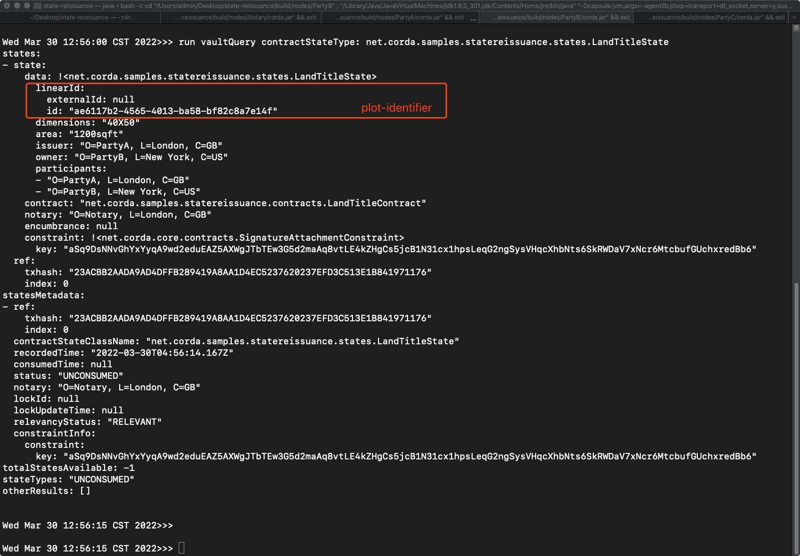
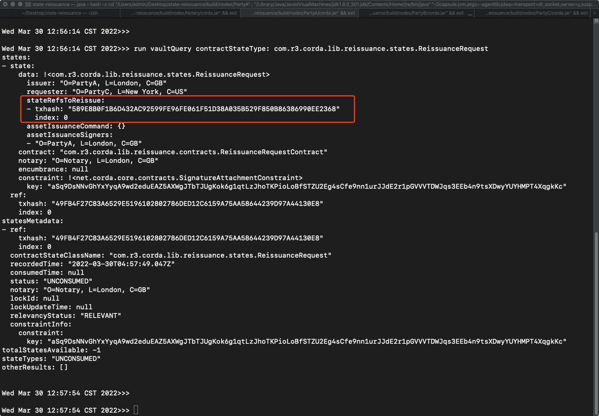
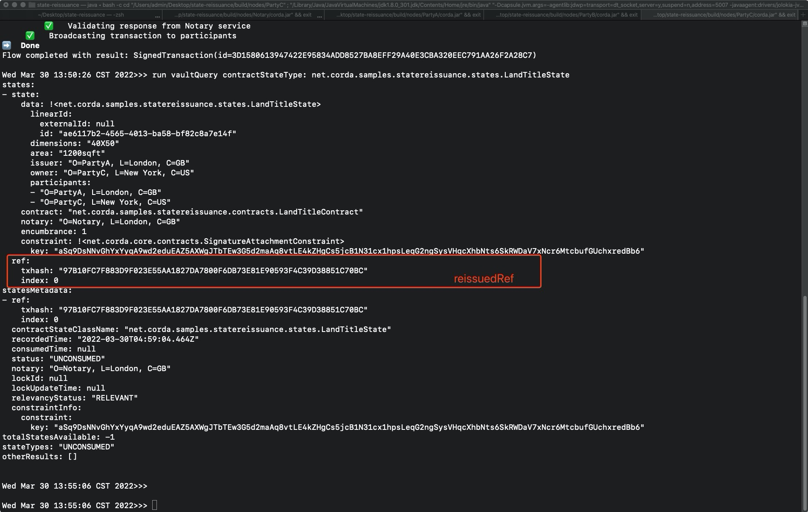
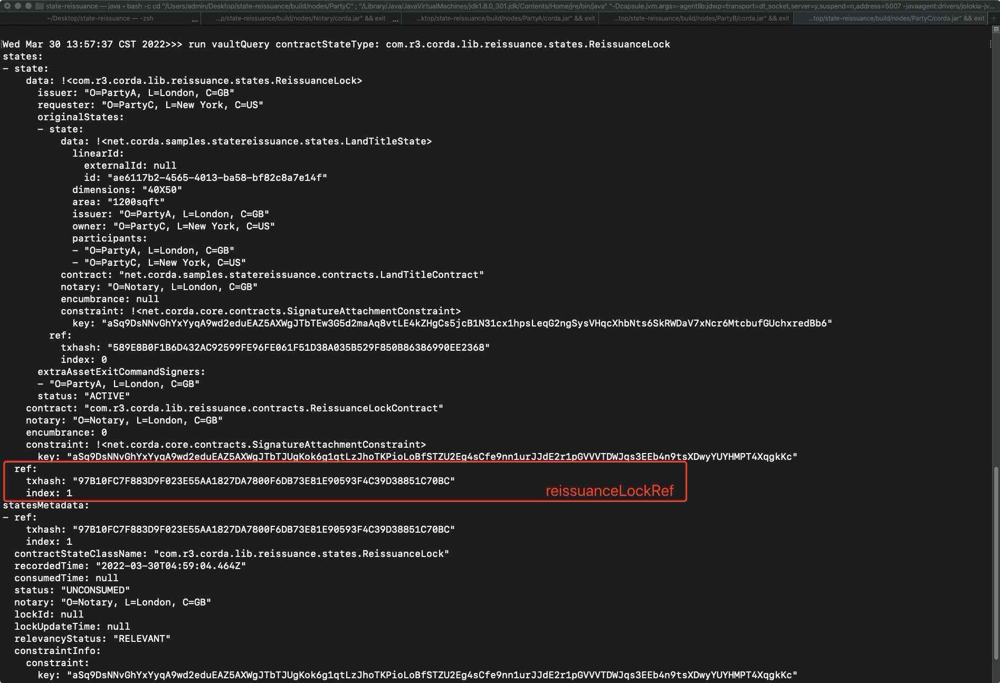
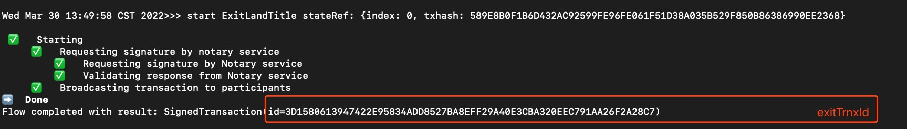
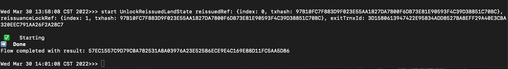
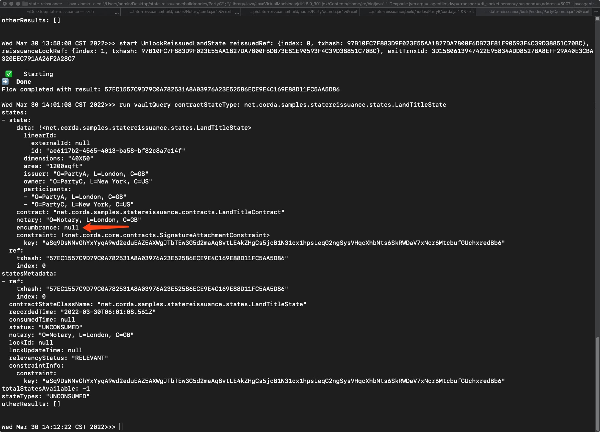

  

# State Reissuance Sample CorDapp

This CorDapp serves as a sample for [state reissuance](https://docs.r3.com/en/platform/corda/4.9/community/reissuing-states.html#consuming-an-original-state-instead-of-deleting-it) feature of Corda. This feature enables developers to break long 
transaction backchains by reissuing a state with a guaranteed state replacement. This is particularly useful in situations
when a party doesn't want to share state history with other parties for privacy or performance concerns.

This samples demonstrates the feature with the help of a [linear state](https://docs.r3.com/en/platform/corda/4.9/community/api-states.html#linearstate), represented by a land title issued on Corda ledger. 
The land title can be transferred multiple times and when the transaction backchain becomes long, the land title could be 
reissued and the transaction backchain could be pruned.

# Pre-Requisites

[Set up for CorDapp development](https://docs.r3.com/en/platform/corda/4.9/community/getting-set-up.html)

# Usage

## Running the CorDapp

Open a terminal and go to the project root directory and type: (to deploy the nodes using bootstrapper)

`./gradlew clean build deployNodes`

Then type: (to run the nodes)

`./build/nodes/runnodes`

## Interacting with the CorDapp

To start, we need PartyA to issue a land title to PartyB. Go to PartyA's interactive node shell and run the below command:

`flow start IssueLandTitle owner: PartyB, dimension: 40X50, area: 1200sqft`

Verify the land title has been issued correctly by querying the ledgers of PartyA and PartyB using the below command.
PartyA should be issuer and PartyB should be the owner of the land title.

`run vaultQuery contractStateType: net.corda.samples.statereissuance.states.LandTitleState`

Once land title has been issued to PartyB, he could transfer it to PartyC. Go to PartyB's terminal and run the below command

`start TransferLandTitle owner: PartyC, plotIdentifier: <plot-identifier>`

You could find the `plot-identifier` from the result of the vaultQuery command used earlier to query the ledgers.

Verify the land title has been correctly tranferred to PartyC by querying the ledgers of PartyA and PartyC using the below command

`run vaultQuery contractStateType: net.corda.samples.statereissuance.states.LandTitleState`

Note that PartyB is no more able to see the land title, since he is no longer a party to the state as he has transferred
the title to PartyC. It is currently only visible to PartyA and PartyC.

Consider that PartyC now wants to reissue the title to get rid of the backchain. He needs to request a re-issuace to the issuer.
Go to PartyC's terminal and run the below command

`flow start RequestReissueLandState issuer: PartyA, plotIdentifier: <plot-identifier>`

Now a re-issuance request is created on the ledgers of PartyA and PartyC, when can be verified using the below command

`run vaultQuery contractStateType: com.r3.corda.lib.reissuance.states.ReissuanceRequest`

The issuer could either accept or reject the re-issuance request. Let's consider the case where the issuer accepts the 
reissuance request. To accept the request goto PartyA's (issuer) terminal and run the below command

`flow start AcceptLandReissuance issuer: PartyA, stateRef: {index: <output-index>, txhash: <trnx-hash>}`

The `<output-index>` and `<trnx-hash>` are of the transaction which created the state to the reissued. They can be found
in the `ReissuanceRequest` queried earlier (the `stateRefsToReissue` field).

On successful completion of the above flow, a duplicate land title would be issued, however it would be currently
locked, and it cannot be spent. In order to spend it, the older state which was requested to be reissued must be exited
and that would allow the new reissued state to be unlocked and spend.

To exit the older land title run the below command from PartyC's terminal.

`start ExitLandTitle stateRef: {index: <output-index>, txhash: <trnx-hash>}`

Once the previous land title is exited, unlock the reissued land title using the below command from PartyC's terminal

`flow start UnlockReissuedLandState reissuedRef: {index: <output-index>, txhash: <tx-hash>}, reissuanceLockRef: {index: <output-index>, txhash: <tx-hash>}, exitTrnxId: <tx-hash>`

The `reissuedRef` is the stateRef of the reissued state.
 
 
 And the `reissuanceLockRef` is the stateRef of the re-issuance lock generated, which can queried using `run vaultQuery contractStateType: com.r3.corda.lib.reissuance.states.ReissuanceLock` 
 
 And the `exitTrnxId` is the transaction hash of the transaction used to exit the older state.
 

Note that the lock uses the encumbrance feature of Corda. You can check out the sample on encumbrance [here](https://github.com/corda/samples-kotlin/tree/master/Features/encumbrance-avatar)

Now with all the information input into the function call, the reissue process is completed and the reissued state can be spent freely.

You can see the encumbrance field is restored to `null` again, meaning the state is free to be transacted again. 

