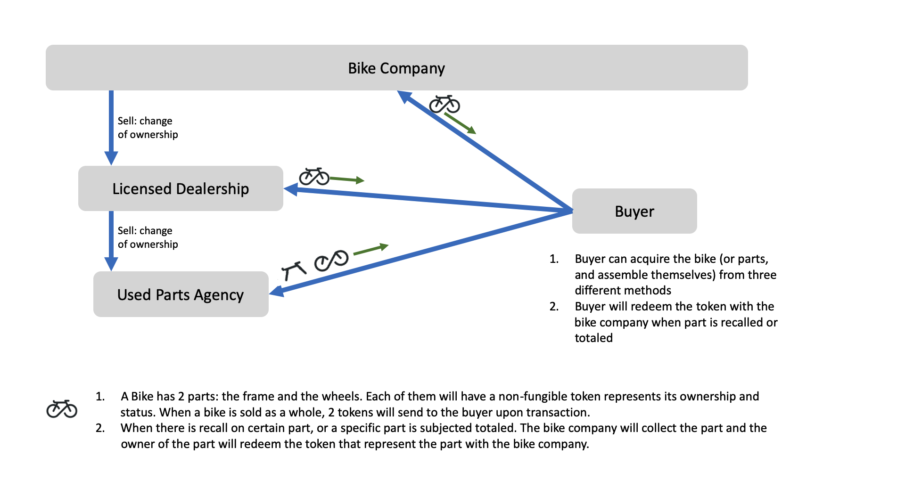

# Bike Market - TokenSDK


## Introduction 
This sample Cordapp demonstrates some simple flows related to the [Token SDK](https://github.com/corda/token-sdk). In this Cordapp,there are four parties: 
- The Bike Company (BikeCo): Manufactures, sells, and recalls/totals the bikes(or parts). 
- The Licensed Dealership: Buys the bikes from the BikeCo
- Used Parts Agency: Buy used parts from the Licensed Dealership (or end-buyers)
- Buyer: Buys bike from the BikeCo or licensed dealership, or buys used parts from used parts agency. 

In this sample Cordapp, we will mimic a bike buying and selling market. 



From the above chat we see that Tokens are representing the ownership and status of the physical assests, such as bike frame and bike wheels. A key point to notice here is that **a bike is represented with 2 tokens (Frame and wheels)**. This is designed in the way to be flexiable to sell or total a specific part of your bike. As can see, this bike buying/selling market is capable of mimicing multiple business logics. We will be demonstrating one of the possible logic here:
1. BikeCo manufactures the bikes
2. BikeCo can sell the bike to licenced dealership and buyers. 
3. Used parts agency can get the used bike parts from the licenced dealership or buyers. 
4. When there is a need of total the physical bike part, the current of the physical part will redeem the token with the BikeCo

Throughout the sample, we will see how to create, transact, and redeem a token. 

## Running the sample
Open a terminal and go to the project root directory and type: (to deploy the nodes using bootstrapper)
```
./gradlew clean build deployNodes
./build/nodes/runnodes
```

## Pre-Requisites
[Set up for CorDapp development](https://docs.r3.com/en/platform/corda/4.9/community/getting-set-up.html)

## Usage
### Running the sample

Once all four nodes and the notary have started up, in BikeCo's interactive node shell, run: 
```
flow start CreateFrameToken frameSerial: F4561
flow start CreateWheelToken wheelsSerial: W7894 
```
After this step, we have created 2 tokens representing the physical bike part with unique serial number (which will be unique in the manufacturing). 
Then run:
```
flow start IssueNewBike frameSerial: F4561, wheelsSerial: W7894, holder: LicensedDealership
```
This line of command will transfer the tokens(2 tokens together represents a single bike) to the licensed dealership. 

Now, at the licensed dealership's interactive node shell, we can see we did receive the tokens by running: 
```
run vaultQuery contractStateType: com.r3.corda.lib.tokens.contracts.states.NonFungibleToken
```
Continue to the business flow, the licensed dealership will sell the bike to the Buyer. Run: 
```
flow start TransferBikeToken frameSerial: F4561, wheelsSerial: W7894, holder: Buyer
```

Now we can check at the Buyer's interactive node shell to see if the buyer receives the token by running the same `vaultQuery` we just ran at the dealership's shell. 

At the Buyer side, we would assume we got a recall notice and will send the physical bike frame back to the manufacturer. The action will happen in real life, but on the ledger we will also need to "destroy"(process of redeem in Corda TokenSDK) the frame token. Run:
```
flow start TotalPart part: frame, serial: F4561
```
At the buyer's shell, if we do the [vaultQuery](https://docs.r3.com/en/platform/corda/4.9/community/api-vault-query.html) again, we will see we now only have a wheel token (the frame token is gone). With the wheel token, we can sell this pair of wheels to the used parts agency. We will achieve it by running: 
```
flow start TransferPartToken part: wheels, serial: W7894, holder: UsedPartsAgency
```
At the end of the flow logic, we will find the frame token is destroyed and the used parts agency holds the wheel token. 


